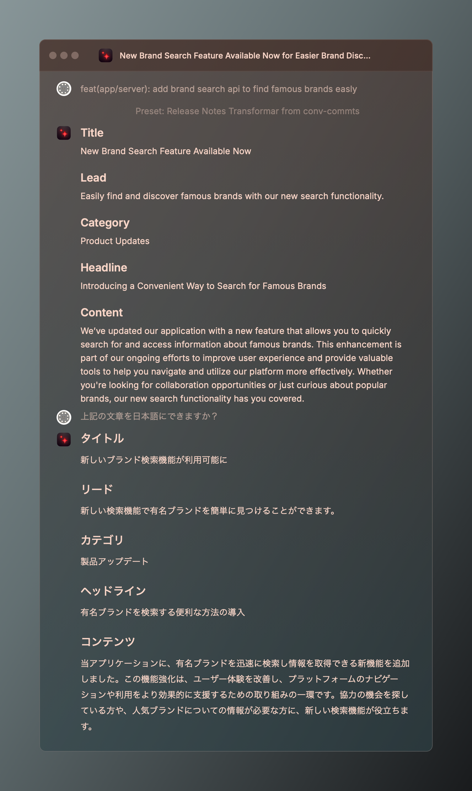

# Japanese Release Note Generator

## 初めに

現在は、[release please](https://github.com/googleapis/release-please)との併用を
前提に作成している。
[SmartHRのリリースノートの書き方](https://smarthr.design/products/contents/help-center/releasenotes/)を
参考に仕様を作成している

## 使い方

TBD

## 動機

下記のような指示をGPT4(via Raycast AI)に与えるとよさそうなリリースノートを生成し
てくれることがわかった

### プロンプト(instruction)例

please transform commit message to readable　release notes for non-engneer
users.

please use the format below """

## Title

## Lead

## Category

## Headline

## Content

"""

### プロンプト

feat(app/server): add brand search api to find famous brands easly

### 結果

```
Title
New Brand Search Feature Available Now
Lead
Easily find and discover famous brands with our new search functionality.
Category
Product Updates
Headline
Introducing a Convenient Way to Search for Famous Brands
Content
We’ve updated our application with a new feature that allows you to quickly search for and access information about famous brands. This enhancement is part of our ongoing efforts to improve user experience and provide valuable tools to help you navigate and utilize our platform more effectively. Whether you're looking for collaboration opportunities or just curious about popular brands, our new search functionality has you covered.
```

日本語にしてもらうと下記になった

```
タイトル
新しいブランド検索機能が利用可能に
リード
新しい検索機能で有名ブランドを簡単に見つけることができます。
カテゴリ
製品アップデート
ヘッドライン
有名ブランドを検索する便利な方法の導入
コンテンツ
当アプリケーションに、有名ブランドを迅速に検索し情報を取得できる新機能を追加しました。この機能強化は、ユーザー体験を改善し、プラットフォームのナビゲーションや利用をより効果的に支援するための取り組みの一環です。協力の機会を探している方や、人気ブランドについての情報が必要な方に、新しい検索機能が役立ちます。
```

会話の例は下記の通りである。


